# 그래프의 표현

## 에지 리스트

- 배열
- 구현하기 쉬움
- 특정 노드와 관련 있는 에지를 탐색하기 쉽지 않음
- 벨만-포드, 크루스칼 알고리즘에 사용
- 노드 중심 알고리즘에는 잘 사용하지 않음

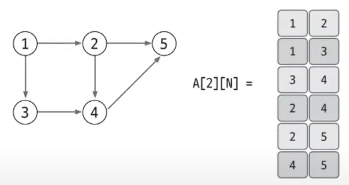</img> 
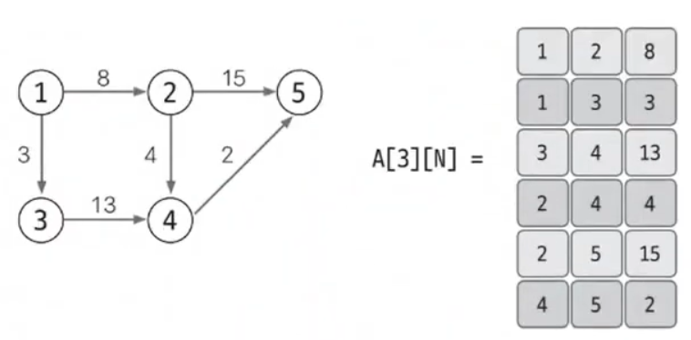</img> 

## 인접 행렬

- 2차원 배열
- 노드 중심으로 그래프를 표현
- 구현하기 쉬움
- 노드와 관련 있는 에지를 탐색하려면 N번 접근해야 하므로 노드 개수에 비해 에지가 적을 때는 공간 효율성 떨어짐
- 노드 개수가 많으면 2차원 배열 선언 자체 불가 ex) 노드가 3만개 넘으면 heap space 에러 발생

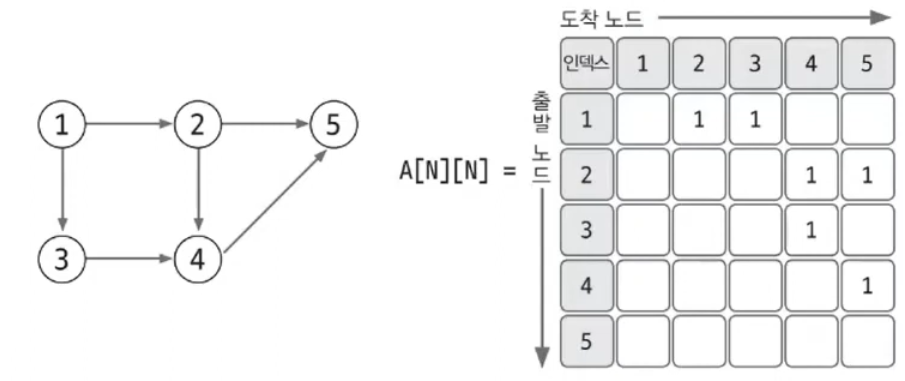</img> 
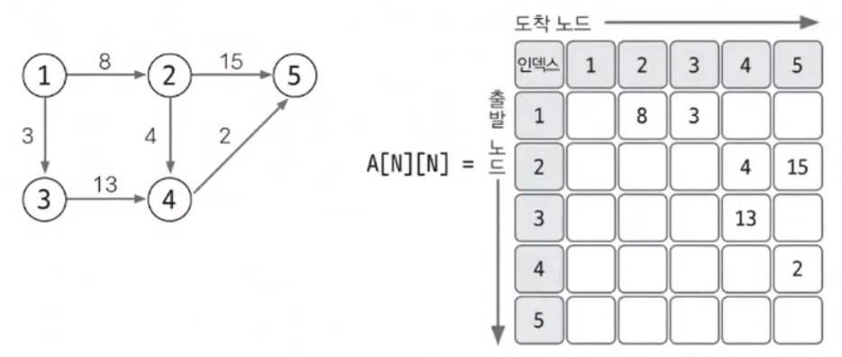</img> 

## ⭐ 인접 리스트

- ArrayList
- 구현 복잡함
- 노드와 연결되어 있는 에지를 탐색하는 시간 매우 뛰어남
- 노드 개수가 커도 공간 효율이 좋아 메모리 초과 에러 발생 X

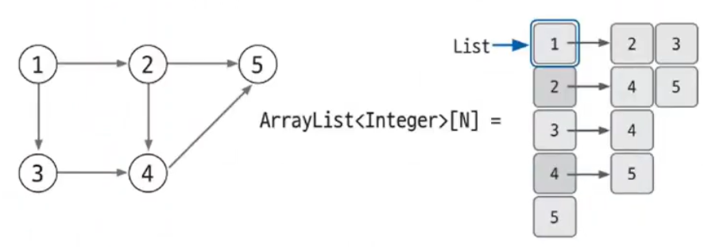</img> 
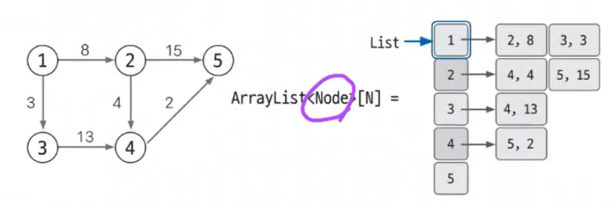</img> 

# 유니온 파인드

- 1차원 배열
- union 연산
    - 여러 노드가 있을 때 특정 2개의 노드를 연결해 1개의 집합으로 묶는 연산
    - 각 노드가 속한 집합을 1개로 합침
    - a ∈ A, b ∈ B일 때 union(a, b) = A ∪ B
- find 연산
    - 두 노드가 같은 집합에 속해 있는지를 확인하는 연산
    - 특정 노드 a에 관해 a가 속한 집합의 대표 노드를 반환
    - a ∈ A일 때 find(a) = A 집합의 대표 노드

# 위상 정렬

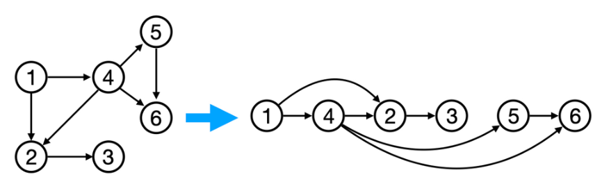</img> 

- 사이클이 없는 방향 그래프에서 노드 순서를 찾는 알고리즘
- 항상 유일한 값으로 정렬되지 않음
- O(V + E) (V: 노드 수, E: 에지 수)

# 다익스트라

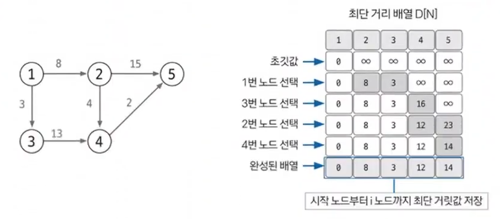</img> 

- 그래프에서 최단 거리를 구하는 알고리즘
- 출발 노드와 모든 노드간의 최단 거리 탐색
- **에지는 모두 양수**
- O(ElogV) (V: 노드 수, E: 에지 수)

1. 인접 리스트로 그래프 구현
2. 최단 거리 배열 초기화
3. 값이 가장 작은 노드 고르기
4. 최단 거리 배열 업데이트
5. 3~4를 반복해 최단 거리 배열 완성

# 벨만-포드

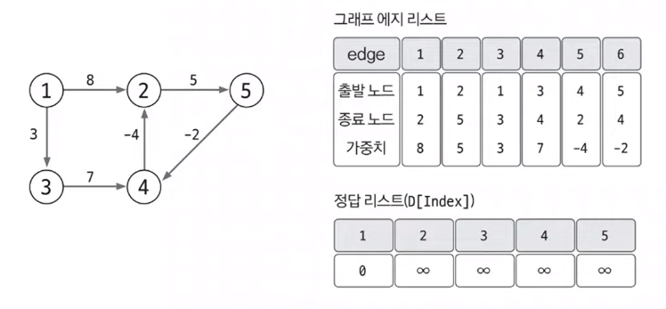</img> 
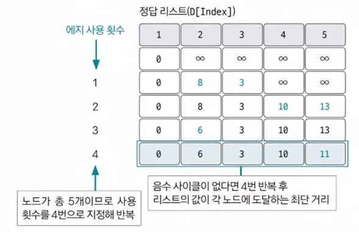</img> 
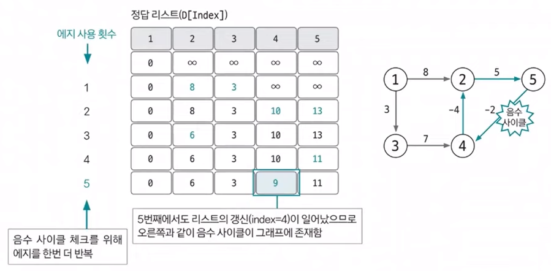</img> 

- 그래프에서 최단 거리를 구하는 알고리즘
- 출발 노드와 모든 노드간의 최단 거리 탐색
- **음수 가중치 에지가 있어도 수행 가능**
- 전체 그래프에서 음수 사이클의 존재 여부를 판단할 수 있음
- O(VE) (V: 노드 수, E: 에지 수)

1. 인접 리스트로 그래프 구현
2. 최단 거리 배열 초기화
3. 모든 에지를 확인해 정답 배열 업데이트
4. 음수 사이클 유무 확인

# 플로이드-워셜

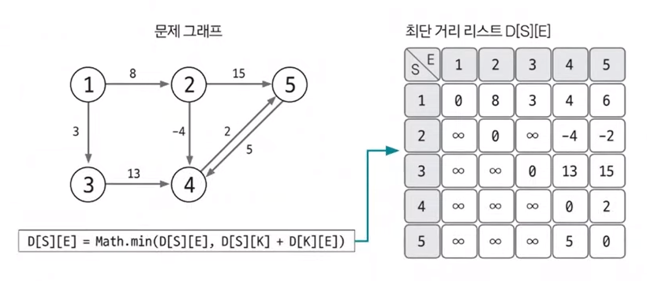</img> 

- 그래프에서 최단 거리를 구하는 알고리즘
- 모든 노드간의 최단 거리 탐색
- **음수 가중치 에지가 있어도 수행 가능**
- 동적 계획법의 원리를 이용해 알고리즘에 접근
- 핵심 원리: 전체 경로의 최단 경로는 부분 경로의 최단 경로의 조합으로 이루어진다.
- 모든 노드간의 최단 거리를 확인하기 때문에 시간 복잡도가 빠르지 않음
- O(V3) (V: 노드 수)

1. 2차원 배열(최단 거리 배열)을 선언하고 초기화
2. 최단 거리 배열에 그래프 데이터 저장
3. 점화식으로 배열 업데이트 (3중 for문)
    - `D[S][E] = Math.min(D[S][E], D[S][K] + D[K][E])`

# 최소 신장 트리

- 그래프에서 모든 노드를 연결할 때 사용된 에지들의 가중치 합을 최소로 하는 트리
- 사이클이 포함되면 가중치의 합이 최소가 될 수 없으므로 사이클을 포함하지 않는다.
- N개의 노드가 있으면 최소 신장 트리를 구성하는 에지의 개수는 항상 N - 1개다.

1. 에지 리스트로 그래프를 구현하고 유니온 파인드 배열 초기화하기
2. 그래프 데이터를 가중치 기준으로 정렬하기
3. 가중치가 낮은 에지부터 연결 시도하기 (반복)
4. 총 에지 비용 출력
