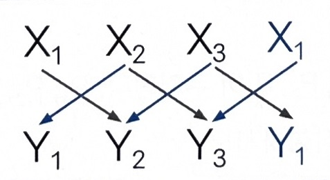
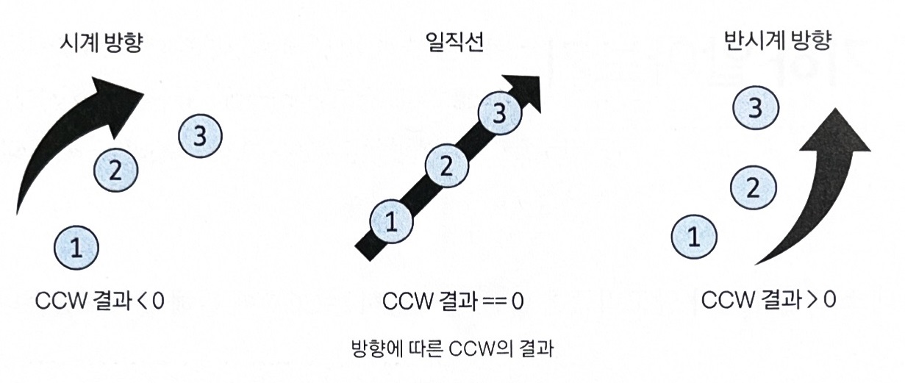

# 기하

> 점, 선, 다각형, 원과 같이 각종 기하학적 도형을 다루는 알고리즘  
> 실제 코테에서는 대부분 CCW라는 기하학적 성질을 이용해 풀 수 있음

## CCW (Counter-Clockwise)

> 평면상의 3개의 점과 관련된 위치 관계를 판단하는 알고리즘

(x1y2 + x2y3 + x3y1) -
(x2y1 + x3y2 + x1y3)

</img> 

- |CCW 결과값| = 세 점의 벡터의 외적값
- |CCW 결과값| / 2 = 세 점으로 이뤄진 삼각형의 넓이

</img> 
