# 트리 알아보기

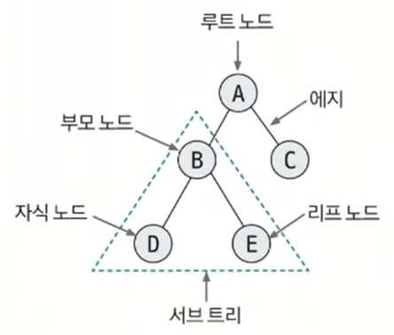</img> 

- 노드와 에지로 연결된 그래프의 특수한 형태
- 1개의 루트 노드 존재
- 루트 노드를 제외한 노드는 단 1개의 부모 노드를 가짐
- 순환 구조를 지니지 않음

# 트라이

- 문자열 검색을 빠르게 실행할 수 있도록 설계한 트리 형태의 자료구조
- N진 트리: 문자 종류의 개수에 따라 N이 결정된다. ex) 알파벳은 26개 문자 -> 26진 트리
- 루트 노드는 항상 빈 문자열을 뜻하는 공백 상태를 유지한다.

# ⭐ 이진 트리

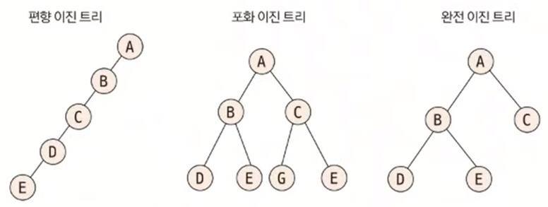</img> 

- 각 노드의 자식 노드(차수)의 개수가 2 이하로 구성되어 있는 트리
- 일반적으로 **배열**로 표현

## ⭐ 1차원 배열로 표현

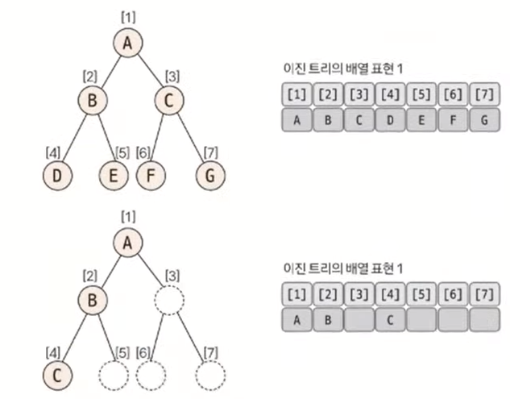</img> 

| 이동 목표 노드  | 인덱스 연산                  | 제약 조건(N = 노드 개수)    |    
|-----------|-------------------------|---------------------|
| 루트 노드     | `index = 0`             |                     |
| 부모 노드     | `index = index / 2`     | 현재 노드가 루트 노드가 아님    |
| 왼쪽 자식 노드  | `index = index * 2`     | `index * 2` ≤ N     |
| 오른쪽 자식 노드 | `index = index * 2 + 1` | `index * 2 + 1` ≤ N |

## 2차원 배열로 표현

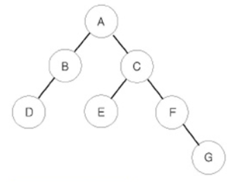</img> 

|       | A | B | C | D | E | F | G |
|-------|---|---|---|---|---|---|---|
| left  | B | D | E |   |   |   |   |
| right | C |   | F |   |   | G |   |

# ⭐ 세그먼트 트리

> [알고리즘 코딩테스트 핵심이론 강의 - 세그먼트트리(인덱스 트리)](https://www.youtube.com/watch?v=1d9sqmuLy-o&list=PLFgS-xIWwNVX-zm4m6suWC9d7Ua9z7fuT&index=37)

- 데이터들의 구간 연산과 데이터 업데이트를 빠르게 수행
- 더 큰 범위는 인덱스 트리 (코테에선 큰 차이 없음)
- 종류: 구간 합, 최대/최소 구하기

1. 트리 초기화
2. 질의값 구하기(구간 합 또는 최대/최소)
3. 데이터 업데이트

## 트리 초기화

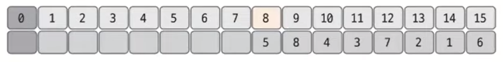</img> 
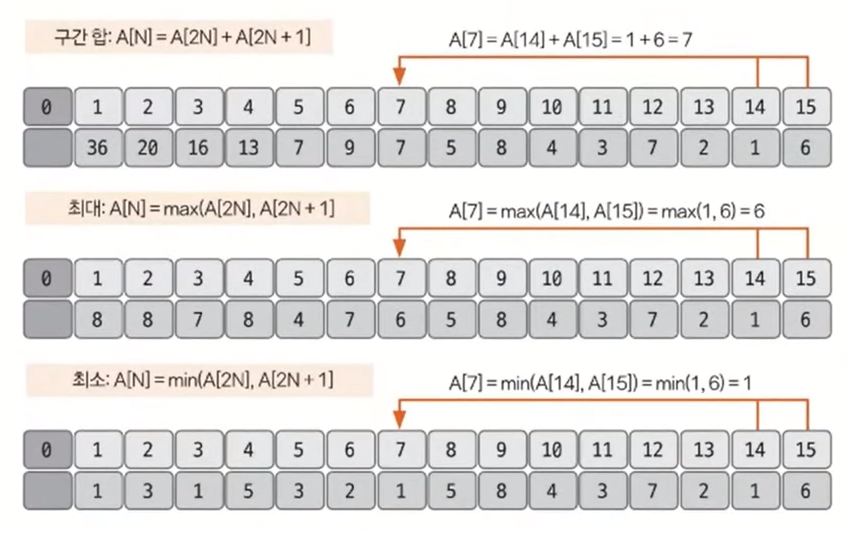</img> 
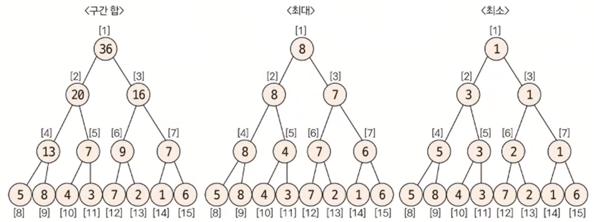</img> 

- 리프 노드의 개수가 데이터의 개수(N) 이상이 되도록 트리 배열 만들기
- 2k + 1 (k = 2k ≥ N을 만족하는 k의 최솟값)
    - ex) N = 8이면 23 ≥ 8 ---> 배열 크기 = 24 = 16
- 2k - 1 부터 1번 쪽으로 값을 채움

## 질의값 구하기

1. 질의 인덱스를 세그먼트 트리 인덱스로 변경
    - 세그먼트 트리 인덱스 = 주어진 질의 인덱스 + (2k - 1)
2. `startIndex % 2 == 1`일 때(오른쪽 노드일 때) 해당 노드를 선택
3. `endIndex % 2 == 0`(왼쪽 노드일 때)일 때 해당 노드를 선택
4. 2 ~ 3에서 노트를 선택했다면 `startIndex = startIndex / 2`, 노드를 선택하지 않았다면 `startIndex = (startIndex + 1) / 2`
5. 2 ~ 3에서 노트를 선택했다면 `endIndex = endIndex / 2`, 노드를 선택하지 않았다면 `endIndex = (endIndex - 1) / 2`
6. 2 ~ 5를 반복하다가 `endIndex < startIndex`가 되면 종료
7. 결과 구하기
    - 구간 합: 선택된 노드들을 모두 더한다.
    - 최댓값/최솟값: 선택된 노드들 중 max/min 값을 선택한다.

ex) 주어진 데이터가 [5, 8, 4, 3, 7, 2, 1, 6]일 때 2 ~ 6번째 구간합 구하기

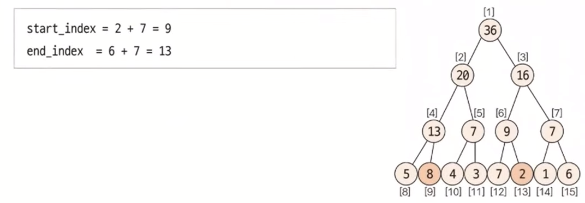</img> 
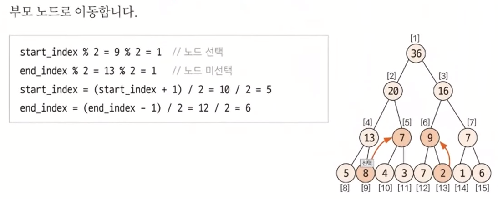</img> 
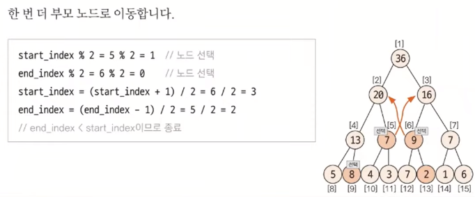</img> 

`end_index < start_index`이므로 종료하고 값을 구한다.

## 데이터 업데이트

- 구간합: 원래 데이터와 변경 데이터의 차이만큼 부모 노드로 올라가면서 변경
- 최댓값: 변경 데이터와 자신과 같은 부모를 지니고 있는 다른 자식 노드와 비교해서 더 큰 값으로 업데이트. 없데이트가 일어나지 않으면 종료
- 최댓값: 변경 데이터와 자신과 같은 부모를 지니고 있는 다른 자식 노드와 비교해서 더 작은 값으로 업데이트. 없데이트가 일어나지 않으면 종료

ex) 5번 데이터 값을 7 -> 10 업데이트

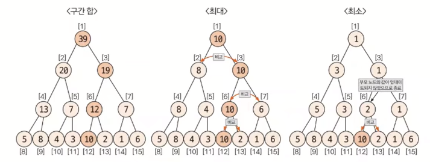</img> 

# 최소 공통 조상

- LCA (Lowest Common Ancestor)
- 트리 그래프에서 임의의 두 노드를 선택했을 때 두 노드가 각각 자신을 포함해 거슬러 올라가면서 부모 노드를 탐색할 때 처음 공통으로 만나게 되는 부모 노드

## 일반적인 연산

- DFS 또는 BFS

1. 두 노드의 깊이가 다른 경우 깊이를 같게 맞춤
2. 동시에 부모 노드로 올라감
3. 처음 만나는 노드가 최소 공통 조상

## 빠른 연산

- 2k씩 올라가 비교
- 2k번째 위치의 부모 노드까지 저장해둬야 함

1. 부모 노드 저장 배열 만들기
    - `P[k][n]` = n번 노드의 2k번째 부모의 노드 번호 = `P[k - 1][P[k - 1][n]]`
    - k = 트리의 깊이 > 2k를 만족하는 최댓값
    - n의 2k번째 부모 노드 = n의 2k - 1번째 부모 노드의 2k - 1번째 부모 노드
    - ex) k = 2일 때, n의 4번째 부모 노드 = n의 2번째 부모 노드의 2번재 부모 노드 
      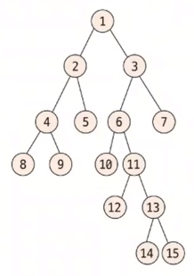</img> 
      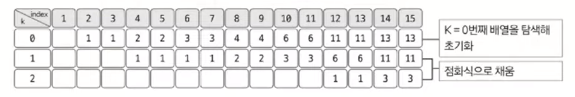</img> 
2. 두 노드 깊이 맞추기
    - P 배열을 이용해 깊이를 2k 단위로 넘어가면서 맞춤
3. 최소 공통 조상 찾기
    - 공통 조상을 찾는 작업도 2k 단위로 점프하면서 맞춤

    1. k값을 1씩 감소하면서 P 배열을 이용해 최초로 두 노드의 부모가 달라지는 값을 찾음
    2. 최초로 달라지는 k에 대한 두 노드의 부모 노드를 찾아 이동 
